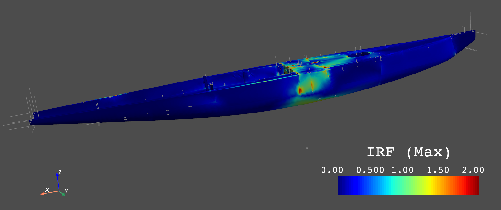

Getting Started
---------------

Testing session (to be removed)
'''''''''''''''''''''''''''''''
Most of the documentation below is still valid for the ansys internal testing session with following exceptions:

Since the module is not yet public, please install from github:

.. code::

    pip install git+https://github.com/pyansys/pydpf-composites.git

Whenever you call the function connect_to_or_start_server you have to pass the location of the 231 installer
with the ansys_path argument:

.. code::

    connect_to_or_start_server(ansys_path=os.environ["AWP_ROOT231"])

Otherwise, the dpf server will be started with the latest installer it finds, which probably is 232.

Installation
''''''''''''

ansys-dpf-composites supports Ansys version 23.1 and later. Make sure you have licensed copy of Ansys installed.
Install the ansys-dpf-composites module from pip:

.. code::

    pip install ansys-dpf-composites

We recommend using a `virtual environment <https://docs.python.org/3/library/venv.html>`_
to keep Python packages isolated from your system Python.

Examples
''''''''

Get started with some basic :doc:`examples/index` :

* :ref:`sphx_glr_examples_gallery_examples_sampling_point_example.py`
* :ref:`sphx_glr_examples_gallery_examples_failure_operator_example.py`

In the end of each example, there is a button to download the python source code of the example.
The examples will download the example files (results, composite definition..) from an examples repository.

Start from a local Ansys Workbench project
''''''''''''''''''''''''''''''''''''''''''

To get started on a local Ansys Workbench project, first determine the result folder by right-clicking on the solution
object in Mechanical and selecting "Open Solver Files Directory". Then call the
:func:`ansys.dpf.composites.get_composite_files_from_workbench_result_folder` function with that folder.
The following  example shows how to setup a project from workbench, create a basic failure plot and display
detailed output for a sampling point.

.. code::

    from ansys.dpf.composites import (
        CompositeModel,
        connect_to_or_start_server,
        get_composite_files_from_workbench_result_folder,
    )
    from ansys.dpf.composites.enums import FailureOutput
    from ansys.dpf.composites.failure_criteria import CombinedFailureCriterion, MaxStressCriterion

    # Folder that opens after clicking "Open Solver Files Directory"
    result_folder = r"D:\simulations\my_simulation_files\dp0\SYS\MECH"

    # Create the composite files object that contains
    # the results file, the material properties file and the
    # composite definitions
    composite_files = get_composite_files_from_workbench_result_folder(result_folder)

    # Start the server. By default this will start
    # a new local server and load the composites plugin
    server = connect_to_or_start_server()

    # Create a composite model
    composite_model = CompositeModel(composite_files, server)

    # Evaluate combined failure criterion
    combined_failure_criterion = CombinedFailureCriterion(failure_criteria=[MaxStressCriterion()])
    failure_result = composite_model.evaluate_failure_criteria(combined_failure_criterion)

    irf_field = failure_result.get_field({"failure_label": FailureOutput.failure_value.value})
    irf_field.plot()

    # Show sampling point for element with id/label 1
    element_id = 1
    sampling_point = composite_model.get_sampling_point(
        combined_criteria=combined_failure_criterion, element_id=element_id
    )

    fig, axes = sampling_point.get_result_plots()
    fig.show()

.. image:: _static/boat_sampling_point.png
  :width: 750
  :alt: Sampling Point on Boat