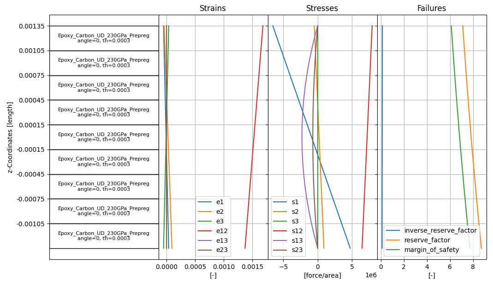

Getting started
---------------

Installation
^^^^^^^^^^^^

PyDPF Composites supports Ansys version 2023 R1 and later. Make sure you have a licensed copy of Ansys installed.

Install the ``ansys-dpf-composites`` package with ``pip``:

.. code::

    pip install ansys-dpf-composites

You should use a `virtual environment <https://docs.python.org/3/library/venv.html>`_,
because it keeps Python packages isolated from your system Python.

Examples
^^^^^^^^

The :doc:`examples/index` section provides these basic examples for getting started:

* :ref:`sphx_glr_examples_gallery_examples_1_failure_operator_example.py`
* :ref:`sphx_glr_examples_gallery_examples_2_sampling_point_example.py`

At the end of each example, there is a button for downloading the example's Python source code.
Clicking this button downloads input files, such as the results file and composite definition,
from a Git repository.

For larger models, initializing the :class:`.CompositeModel` class can be slow because it
automatically creates many different providers that are not needed in all workflows.
Consider using the :ref:`Layup information <layup_information_classes>` classes directly.

Start from a local Ansys Workbench project
""""""""""""""""""""""""""""""""""""""""""

To get started on a local Ansys Workbench project, first determine the result folder by
right-clicking the solution object in Ansys Mechanical and selecting **Open Solver Files Directory**.
Then call the :func:`.get_composite_files_from_workbench_result_folder` method with this folder.

This code shows how to set up a project from Workbench, create a basic failure plot, and display
detailed output for a sampling point:

.. code::

    from ansys.dpf.composites.composite_model import CompositeModel
    from ansys.dpf.composites.constants import FailureOutput
    from ansys.dpf.composites.data_sources import get_composite_files_from_workbench_result_folder
    from ansys.dpf.composites.failure_criteria import CombinedFailureCriterion, MaxStressCriterion
    from ansys.dpf.composites.server_helpers import connect_to_or_start_server

    # Folder that opens after clicking "Open Solver Files Directory"
    result_folder = r"D:\simulations\my_simulation_files\dp0\SYS\MECH"

    # Create the composite files object that contains
    # the results file, the material properties file, and the
    # composite definitions
    composite_files = get_composite_files_from_workbench_result_folder(result_folder)

    # Start the server. By default this starts
    # a new local server and loads the composites plugin
    server = connect_to_or_start_server()

    # Create a composite model
    composite_model = CompositeModel(composite_files, server)

    # Evaluate combined failure criterion
    combined_failure_criterion = CombinedFailureCriterion(failure_criteria=[MaxStressCriterion()])
    failure_result = composite_model.evaluate_failure_criteria(combined_failure_criterion)

    irf_field = failure_result.get_field({"failure_label": FailureOutput.FAILURE_VALUE})
    irf_field.plot()

    # Show sampling point for element with id/label 1
    element_id = 1
    sampling_point = composite_model.get_sampling_point(
        combined_criterion=combined_failure_criterion, element_id=element_id
    )

    sampling_point.get_result_plots()

.. image:: _static/boat_irf.png
  :width: 750
  :alt: IRF plot on boat

